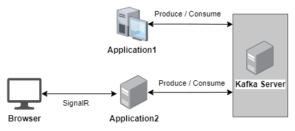

# Introduction

This exercise is a demonstration of two different applications exchanging messages with each other.

This solution consists of:
 - **Application1**: A desktop application that connects to the **Kafka Cluster**.
 - **Application2**: A web application that connects to the **Kafka Cluster** and provides **SignalR Hub**.
 - **Kafka Server**: An event hub that enables applications to produce and consume messages.
 - **SignalR Hub**: Enables server code to send asynchronous notifications to client-side web applications.

 

# Getting Started

1. Install docker.
2. Start Kafka.

Open the root folder of this project and run:

```
docker-compose up -d
```

This command starts a Kafka instance on port 9092.

3. Start Application1 and Application2.

It doesn't matter the starting order.

4. Send a message

Open Application1 or Application2, insert a message on the input field.

5. Check the results

It is expected that a message is displayed in both applications.